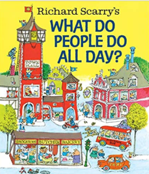
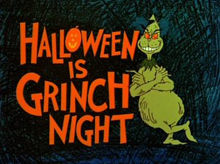
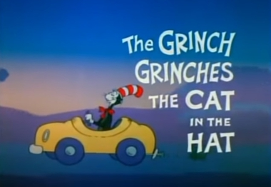
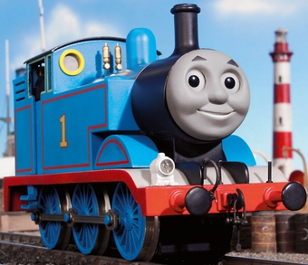

The one where Aleks writes about nostalgia
===

I’ve been wanting to write this one for a while. The world of childens’ books, music, and television is full of all sorts of new exciting things, and for those of you who have not had a chance to dive into that world, I’d love to get into the new stuff in a new email. But for now, I really want to visit the old. Because a surprising amount of the stuff I remember from my childhood is still around (and popular). 
 
Okay, so let’s get into it.  This risks getting real dark, so I’ll start with the bad and end with the good. 

The Bad
---

They’re not all bad. This particular book, _What Do People Do All Day?) is for the most pretty good and a surprisingly in depth (if dated) representing of how a town works. However, the overall collection suffers from issues that make it really hard to revisit:

* The racial stereotyping in some of the books is pretty ugly. Things like Japanese characters all having names like Yakisoba. (European characters have normal names.) Similarly, the depiction of indigenous Americans is pretty cringy.  
* The books pivot from technical accuracy to complete nonsense in a way that makes it hard to explain what is going on. “Why did the car stop?” “Oh, you can see here he got a flat tire, so daddy cat has to pull over to change the tire.” “Why does the trunk have teeth in it?” “…I don’t know. No more questions.” 
* Why is the blimp a giant hotdog? I have no idea. Because the pilot is German or something.

Okay, so after writing it out, that doesn’t sound too bad. But I want to emphasize that first bullet point really grinds when reading it these days.

The Weird
---

_Dr Seuss_

For the most part, I found Dr. Seuss books to be what I remembered. They don’t really stand out as much against all the other things out there now, but Amelia still likes _Cat in the Hat_ and _Hop on Pop_. (I only had _The Cat in the Hat Came Back_ growing up. Who was this cat? And where did he come back from? These were questions that I’ve only recently had answered.)
 
Besides the books, everyone remembers the _How the Grinch Stole Christmas) movie. Classic. That one also help up pretty well.
 
What you may not know is there were two other Grinch television specials. And if you did know this at one point, you would be forgiven for putting them out of your memory. Because they’re fucking weird. 
 
The first, _Halloween is Grinch Night_, was released in 1977. 

In this story, the Grinch sets off to haunt Whoville on Halloween night. He encounters a young boy on the way, who he then throws into a nightmare world to be tormented. And that’s pretty much it. That’s the story. 
 
That won a Primetime Emmy Award for children’s programming. Apparently things were different back then.

Then in 1982, there was _The Grinch Grinches the Cat in the Hat_. 

Very similar story. The Grinch encountered The Cat in the Hat, and doesn’t like his face or something, so he proceeds to psychologically torment him for the next 20 minutes. And again, that’s basically it. At the end he feels bad because he remembers he (the Grinch) had a mom. 
 
That one also got an Emmy. 
 
Someone who was alive during the decade where these were made, please tell me what was going on. 

The Excelleng
---

_Peter, Paul, and Mary_

Okay, for this one I really, truly have no snark. I remember Peter, Paul, and Mary songs in my childhood, and upon registering, they’re just excellent. They’re the grape juice of my childhood that has aged into a fine wine. 
 
Just have a listen. I really can’t add any more to it. 

_Thomas the Tank Engine_

Thomas the Tank Engine holds up really well to the test of time. Even though it wasn’t filmed in HD, the sets they put together with those little engines are still mind-blowing. No notes here.

Okay, some notes:

* Some of the older episodes are quite sexist. Like, why are all the engines male and all the coaches female? And later, when they introduce a female engine, why is she the only one with makeup? The later episodes remedy this a bit and the series ends with a more balanced cast. 
* The show is also classist. There is a lot of talk about what is proper (though I suspect this is a bit tongue-in-cheek), and the depiction of the working class (the freight cars) is pretty vile. 
 
But of course, that assumes we’re talking about the old _Thomas the Tank Engine_. Which, for reasons I am about to get to, is the only one worth watching (despite the problems above).

Because the 3D animated one is just terrible:

Okay, maybe it isn’t _The Grinch Tortures People_ bad, but it lacks much of the charm of its predacessor.
 
One of the things I really appreciated about the original _Thomas_ is that the engines, despite being sentient, still operate like normal steam engines. They don’t move without their driver manipulating the controls. They rely on signalmen to set the switches to get to the right places. They need coal, water, oil, etc. to operate. They’re still machines. It imposes an interesting constraint on the story that keeps the writers from getting too lazy.[0]
 
It’s also narrated by Ringo Starr in the UK version and George Carlin in the US version. 
 
However, the new one has none of that. The engines basically do what they want in the world; go where they decide to go. For example, in one of the feature length films, Thomas decides to get on a boat and follow his new race-car friend around the world. 
 
But what’s crazy about that is that in the 3D show, the engines still visibly have people in the driver cab. But they’re just like…along for the ride? Like Thomas says, I’m going to South America, and these two dudes in the cab are just like…whelp, I guess that’s what's happening. 
 
Anyway, that’s all I have for now. In a follow up, I’d love to share some of my favorite new things we’ve discovered. Until then, take care and stay safe.
 
---

[0] I think it’s actually an interesting metaphor for the human condition. Because, while the narrator describes what is going on mechanically with the trains (driver forgot to set the break, etc.), the trains often think they’re moving or acting of their own volition. That is, you have a completely mechanical entity, that obeys the laws of physics, but retroactively ascribes its actions to its own consciousness. Makes you think. 